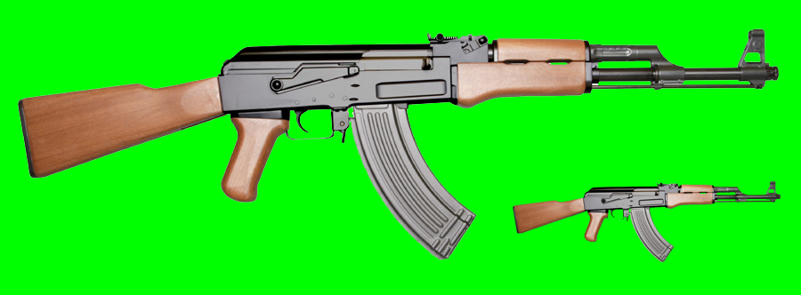
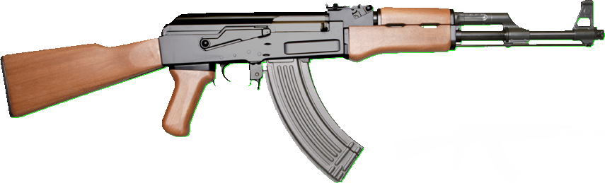
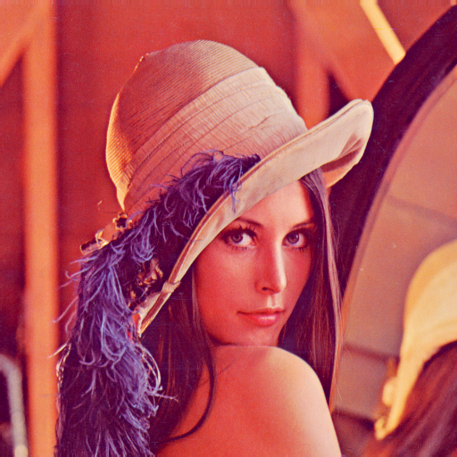
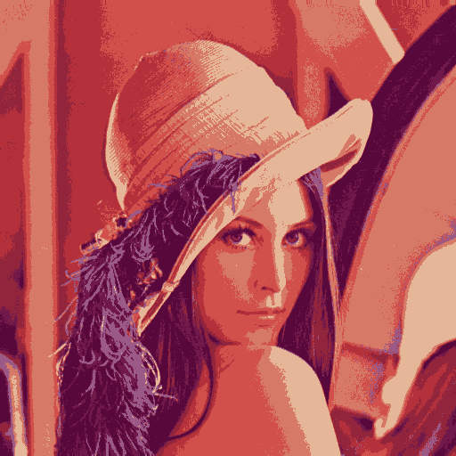
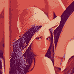
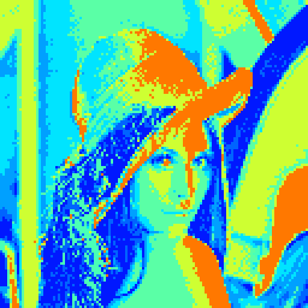
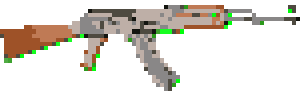

# The very best indie game developer tools to get graphics

## Table of contents
1. [GetMeThoseObjects](#what-is-getmethoseobjects)
    1. [Running it](#running-it)
        1. [Requirements](#requirements)
        2. [Parameters](#parameters)
    2. [Tecnical Explanation](#tecnical-explanation)
        1. [Sampling Top Left Corner](#sampling-top-left-corner)
        2. [Color Thresholding](#color-thresholding)
        3. [Morphological Transformation](#morphological-transformation)
        4. [Finding Contours](#finding-contours)
        5. [Bounding Rectangle](#bounding-rectangle)
    3. [Results](#results)
2. [PixelArtIt](#what-is-pixelartit)
    1. [What is pixel art?](#what-is-pixel-art)
    2. [Running it](#running-it-1)
        1. [Requirements](#requirements-1)
        2. [Parameters](#parameters-1)
        3. [Simple File Exe compilation comand - Windows 10](#simple-file-exe-compilation-comand---windows-10)
    3. [Tecnical Explanation](#tecnical-explanation-1)
        1. [Saturation](#saturation)
        2. [Color Clustering](#color-clustering)
        3. [Downscaling and Upscaling](#downscaling-and-upscaling)
        4. [Color Filtering](#color-filtering)
    4. [Results](#results-1)
3. [Combined Result](#combined-result)

# GetMeThoseObjects

## What is GetMeThoseObjects?
GetMeThoseObjects is a python script that tries to split an image into multiple images one per each object !
This script was made for the course of Computer Vision @ DCC.FCUP by João Estrela (up201207860)

## Running it
### Requirements
* Python 2.7 or above
* Python Libraries:
    - cv2
    - numpy
    - argparse
    - ntpath

### Parameters

| Parameter | Parameter Full Name | Required | Description                                             |
|-----------|---------------------|----------|---------------------------------------------------------|
| i         | image               | yes      | input image path                                        |
| o         | output              | no       | output folder for objects images                        |

## Tecnical Explanation

### Sampling Top Left Corner

To have a clue about the background GetMeThoseObjects script extracts the hue values in the top left corner.
With the range of hues it can start working on getting a mask.

### Color Thresholding

The values obtained in the sampling of the top left corner are used in this stage to make a mask of the pixels in those hue ranges.
That mask represents the background and should be inverted to represent the objects.

### Morphological Transformation

With the mask done there are some tecniques usefull to remove the noise and make it easier to find contours later.
The morphological Transformation used is called Close and its the combination of dilatation followed by erosion.
The erosion is similar to natural erosion and is used to erode the bondaries of the foreground object.
The dilatation is the opposite of erosion and is used to increase the bondaries of the foreground object.
With these two combined is possible to close small holes in the foreground object.

The kernel used for these transformations is 1x1 as it is only used to make it easier to find the contours in the next step.

### Finding Contours

Finding contours is crucial for GetMeThoseObjects script as it enables to enumerate the diferent objects in a image.
With these contours it knows how to mask each object individually.

### Bounding Rectangle

To get each object in its separated image file, it is created a Bounding Rectangle for each object and then applied to the original image together with the mask made with the contours.

## Results

Original:



Objects:




# PixelArtIt

## What is PixelArtIt?
PixelArtIt is a python script that uses a input image to make a new pixel art image !
This script was made for the course of Computer Vision @ DCC.FCUP by João Estrela (up201207860)

## What is pixel art?

Pixel art is a form of digital art, created through the use of software, where images are edited on the pixel level.
The majority of graphics for 8-bit and 16-bit computers and video game consoles, as well as other limited systems like graphing calculators, is pixel art. - [Wikipedia](https://en.wikipedia.org/wiki/Pixel_art)

## Running it
### Requirements
* Python 2.7 or above
* Python Libraries:
    - cv2
    - numpy
    - sklearn
    - argparse
    - ntpath

### Parameters

| Parameter | Parameter Full Name | Required | Description                                             |
|-----------|---------------------|----------|---------------------------------------------------------|
| i         | image               | yes      | input image path                                        |
| o         | output              | no       | output image path                                       |
| s         | saturation          | no       | increase in saturation                                  |
| c         | clusters            | no       | number of color clusters/max number of colors in output |
| d         | downscaling         | no       | downscaling scale for pixelated effect                  |
| cf        | colorFilter         | no       | apply color mapping                                     |
| st        | steps               | no       | enable saving images for each step                      |
| r         | resize              | no       | resize the result to a specific size                    |

### Running comands
Making Lenna a Pixer Art artwork !
```
python PixelArtIt.py -i lenna.png
```
Making Lenna a Pixer Art artwork with a litte of pink!
```
python PixelArtIt.py -cf PINK -i lenna.png
```

### Simple File Exe compilation comand - Windows 10
```
pyinstaller --onefile --icon "PixelArtItIcon.ico" --paths "C:\Program Files (x86)\Python36-32\Lib\site-packages\scipy\extra-dll" "C:/Program Files (x86)/Windows Kits/10/Redist/ucrt/DLLs/x86"--additional-hooks-dir=. PixelArtIt.py
```

## Tecnical Explanation

### Saturation

In pixel art vivid colors are a must ! In a time where only a few colors could survive the most vivid ones where the most used to capture the attention of the visualizer!

By converting the color space to HSV PixelArtIt is able to change the S value (Saturation) for every pixel in a way that affects every color in RGB space in the same way.

In PixelArtIt the default value for changing saturation is 25%.

### Color Clustering

In the old days, computers could only use use 3 bits for each color. That means that only 8 (2^3) colors could be present in a image.

PixelArtIt uses K-Clustering to get the K most relevant colors in the image and produce a new image with only those K clusters present.

The default value for K is 8.

### Downscaling and Upscaling

Back in the day, space and memory were short and images sufered because their resolutions had to be small, some times as short as 8x8, 16x16, or 32x32 a bit later.

To make images small as those sizes, there is a bit of downscaling to be done, but to get the pixelated look right it can't be any kind of interpolation. The best one for this effect is Nearest Neighbor because it tries to mantain the most important details without adding assumptions.

Well it is 2017 and we don't really need our images to be that small and to get back our image to the original size we upscale using Nearest Neighbor so it maintains it's pixelated look.

The default value for Downscaling is 0.25 but is advised to use lower values in some cases.

### Color Filtering

In a world where there only can be represented 8 or 16 colors there was the need to display more! And so palettes were created !
These paletters were used to map the original 8 or 16 colors to 8 or 16 new colors.

To achive similar effects PixelArtIt uses 256 color maps and maps the colors present in the already pixelated image to new ones.

PixelArtIt has 12 color maps provided by openCV library but has also an option to use a custom one. The custom color map must be a 256x1 image named custom_colormap.png.

Custom Color Map Example: 

## Resullts     
Original:


Saturation:



Quantized:



Downscaled:



Rescaled:


Color Mapped (JET):




# Combined Result

The result shown here is using all default values. With a bit of tweaking could be better !


